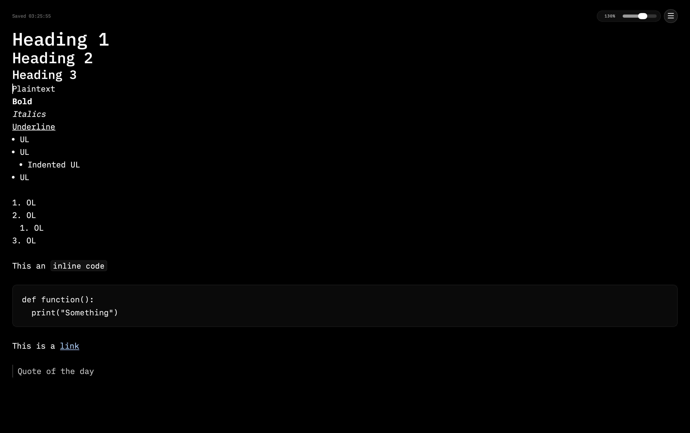
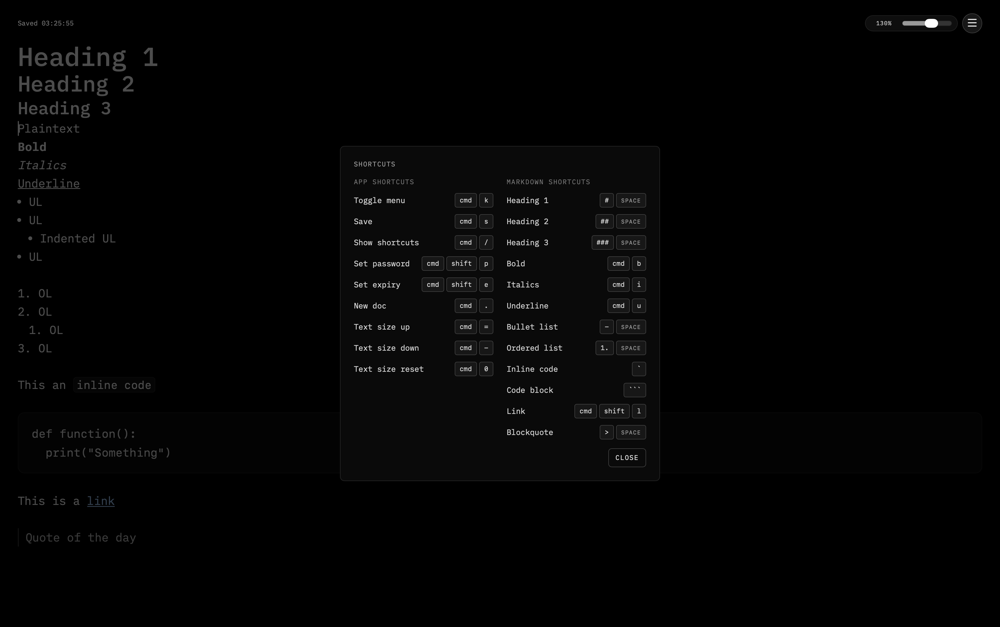

# Markdown Pastebin

    

Super-minimal, black-canvas paste app inspired by [textarea](https://github.com/antonmedv/textarea)(for the text editor) and [pastebin](https://pastebin.com)(for the concept and features). Documents are stored server-side and shared via short URLs like `/d/<id>`.

A [link](https://pastebin.kush.al/d/rx-FMLt-) with all markdown types supported being shown (same as in images below)

---

## What the app does

Create disposable notes, share via short URLs, and optionally lock with a one-time password or set expiry. The editor uses Tiptap with markdown-style shortcuts, and documents are stored as JSON with a fast, minimal UI.

---

## Photo

---

## Architecture

- `client`: React/Vite frontend with Tiptap editor and share/QR UI.
- `server`: Fastify API serving document CRUD, password/expiry, and config.
- `data`: SQLite database for document storage.

---

## Running using Docker Compose locally

1. Copy `.env.example` to `.env` and update `APP_BASE_URL`/`PORT` (and set `AUTH_SECRET` for stable logins).
2. Build and start: `docker compose up --build -d`.
3. Access the UI at `http://localhost:5173` (dev) or `http://localhost:3123` (API).
4. API entry points: `POST /api/docs`, `GET /api/docs/:id`, `PUT /api/docs/:id`.
5. Stop the stack: `docker compose down`. Tail logs: `docker compose logs -f`.
